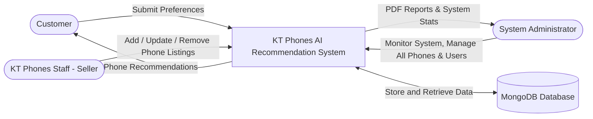
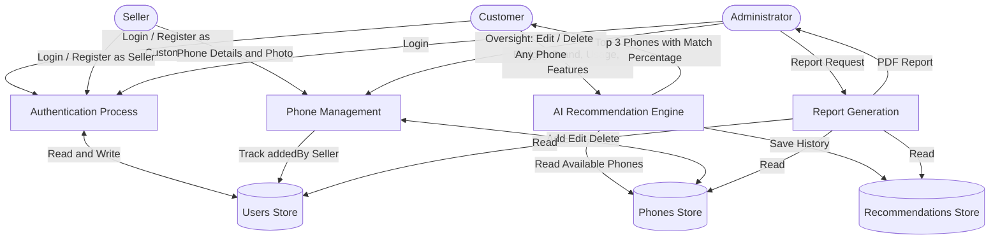
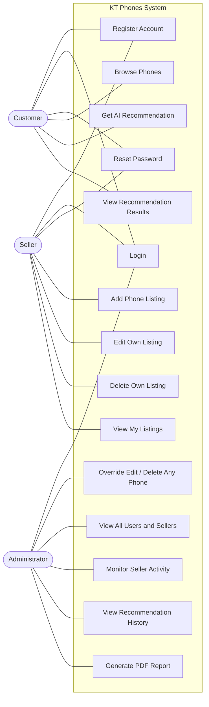
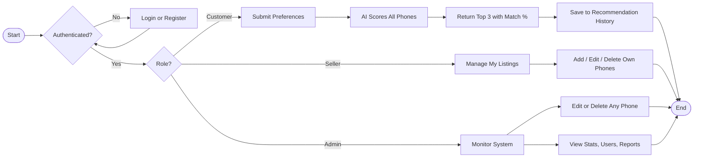
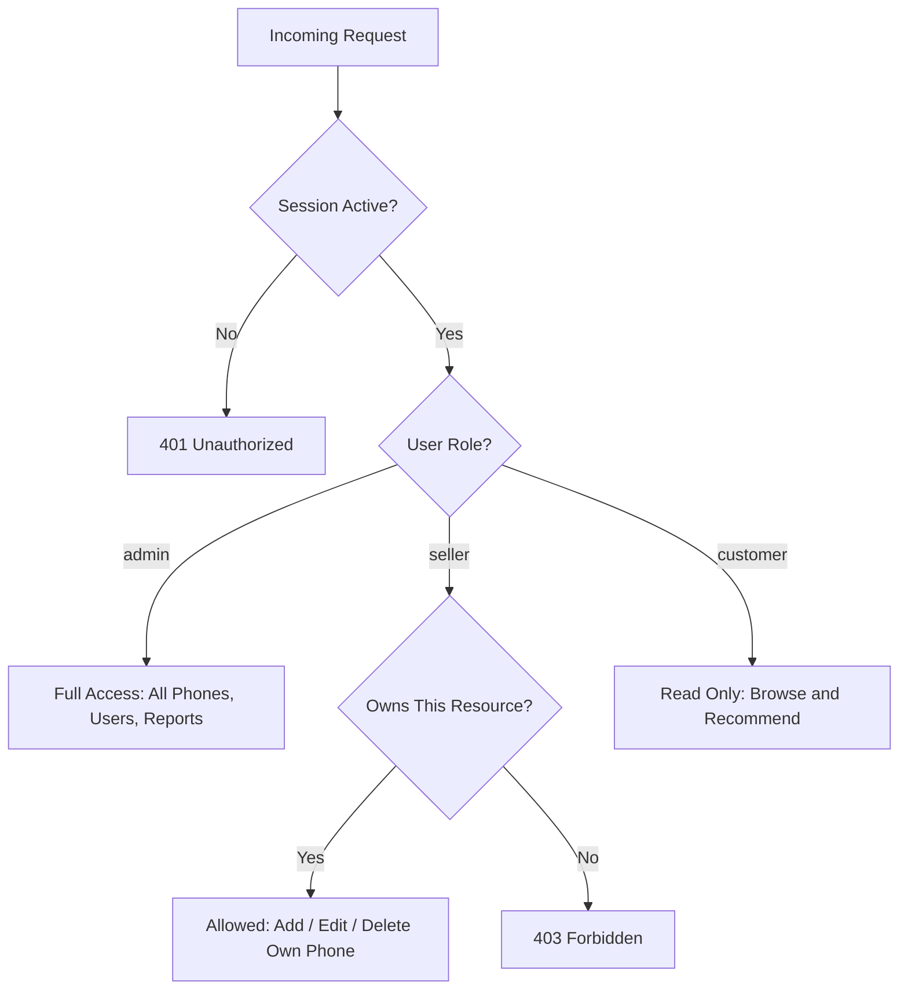
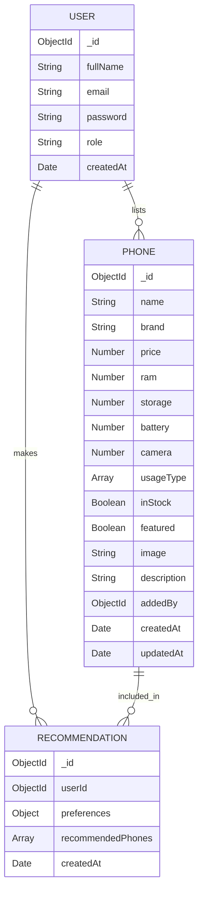

# KT Phones - System Diagrams

---

## 1. Context Diagram



---

## 2. Data Flow Diagram (Level 1)



---

## 3. Use Case Diagram



---

## 4. Activity Diagram - System Flow



---

## 5. Role-Based Access Control Diagram



---

## 6. Entity Relationship Diagram



---

## 7. System Architecture Diagram

```mermaid
graph TD
    Browser[Browser HTML CSS JS]

    subgraph Express Server
        AuthRoutes[/api/auth]
        PhoneRoutes[/api/phones]
        RecommendRoutes[/api/recommend]
        ReportRoutes[/api/report]
        AuthMiddleware[middleware/auth.js isAdmin isSeller isAdminOrSeller]
    end

    subgraph Controllers
        AuthCtrl[authController.js]
        PhoneCtrl[phoneController.js]
        RecommendCtrl[recommendController.js]
    end

    subgraph Models
        UserModel[User.js]
        PhoneModel[Phone.js]
        RecModel[Recommendation.js]
    end

    MongoDB[(MongoDB)]

    Browser --> AuthRoutes
    Browser --> PhoneRoutes
    Browser --> RecommendRoutes
    Browser --> ReportRoutes

    PhoneRoutes --> AuthMiddleware
    AuthMiddleware --> PhoneCtrl

    AuthRoutes --> AuthCtrl
    RecommendRoutes --> RecommendCtrl

    AuthCtrl --> UserModel
    PhoneCtrl --> PhoneModel
    RecommendCtrl --> PhoneModel
    RecommendCtrl --> RecModel

    UserModel --> MongoDB
    PhoneModel --> MongoDB
    RecModel --> MongoDB
```

---

*View diagrams interactively at https://mermaid.live — paste any code block above.*
