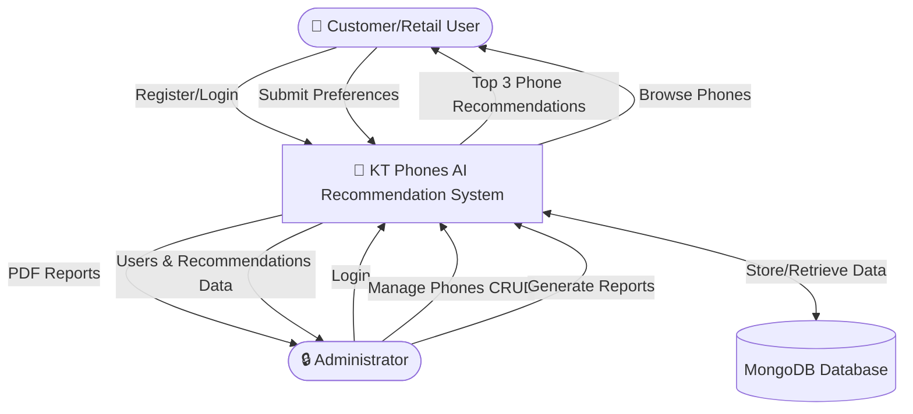
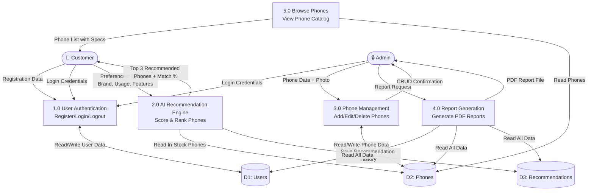
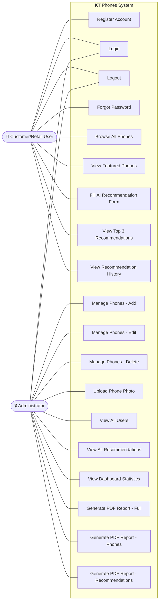
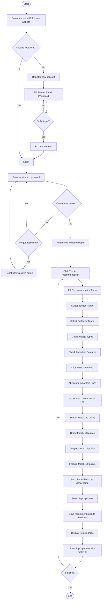
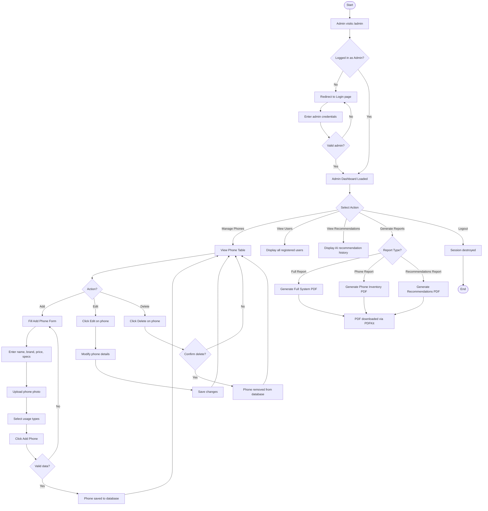
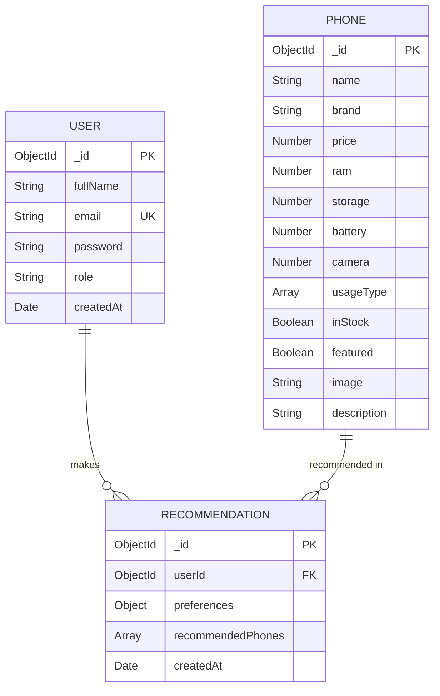
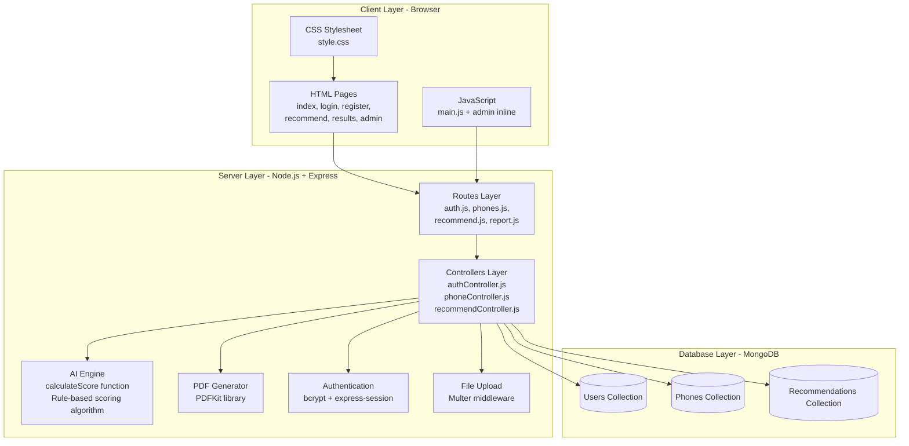

# KT Phones - System Diagrams

## AI-Based Mobile Phone Recommendation Management Information System

---

## 1. Context Diagram (Level 0 DFD)

Shows the system as a single process and its interaction with external entities.

---

## 2. Data Flow Diagram (DFD Level 1)

Shows the main processes within the system and how data flows between them.

---

## 3. Use Case Diagram

Shows what each actor (Customer and Admin) can do in the system.

---

## 4. Activity Diagram - Customer Getting AI Recommendation

Shows the step-by-step flow when a customer uses the AI recommendation feature.

---

## 5. Activity Diagram - Admin Managing System

Shows the admin workflow for managing the system.

---

## 6. Entity Relationship Diagram (ERD)

Shows the database structure and relationships between collections.

---

## 7. System Architecture Diagram

Shows the technical layers of the application.

---

## How to View These Diagrams

1. **GitHub** — Push this file to GitHub, it renders Mermaid diagrams automatically
2. **VS Code** — Install the "Markdown Preview Mermaid Support" extension
3. **Online** — Paste the mermaid code at https://mermaid.live/
4. **PDF Export** — Use a Markdown-to-PDF tool that supports Mermaid

---

*KT Phones © 2024 - AI-Based Mobile Phone Recommendation Management Information System*
